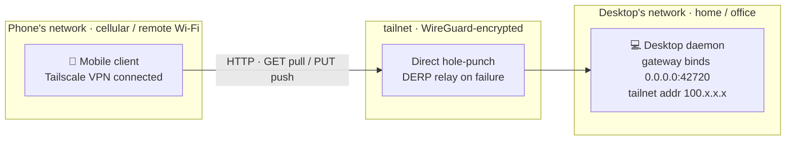

import { Step, Steps } from 'fumadocs-ui/components/steps'
import { Tab, Tabs } from 'fumadocs-ui/components/tabs'

UniClipboard's mobile client is an **HTTP companion** — it doesn't join your
space's trust mesh and doesn't run a P2P node. It just talks to the small HTTP
gateway the desktop exposes, using a base URL + Basic Auth. By default that
gateway is **only reachable on the same Wi-Fi**: once the phone moves to
cellular or someone else's Wi-Fi, it can't reach it.

Put the desktop and the phone on the same **Tailscale network (tailnet)** and
each gets a `100.x.x.x` address — the phone can then reach the desktop exactly
as if they shared a LAN, with the whole path carried over the Tailscale /
WireGuard tunnel. No VPS, no domain, no certificates.

This page covers:

- what this does and — importantly — what it does **not** do (it does not close
  your gateway off)
- how to configure the desktop and phone (GUI and CLI)
- why one QR scan gives you both a LAN and a tailnet address
- advanced: routing desktop-↔-desktop P2P over the tailnet too
- how to choose between this and a [self-hosted server node](./self-host-server-node)

## What it solves, and what it doesn't

It changes **reachability** only — the wire protocol is untouched:

- **Solves**: the phone can reach the desktop gateway from any network.
  Confidentiality comes from the Tailscale / WireGuard tunnel you trust.
- **Doesn't solve**: the gateway still speaks **plain HTTP + Basic Auth**. This
  path gives you no end-to-end TLS semantics — if your threat model needs that,
  see [self-hosted server node](./self-host-server-node) (real HTTPS certs).
- **Doesn't solve**: when the desktop sleeps or shuts down, the phone can't
  reach it either. A tailnet won't keep your desktop online. If you need sync to
  stay up while every desktop sleeps, that's the server-node scenario.

<Callout type="warn">
  **Tailscale does not close the listener on your LAN.** The gateway socket
  **always binds `0.0.0.0`** — this is not configurable. The **Bind IP** picker
  used below is **advertisement-only**: it decides which address goes into the
  install URL / QR handed to the phone, and **nothing else**. Even after you
  pick `100.x.x.x`, the gateway **is still listening in cleartext on your
  physical LAN**. Tailscale gets your phone *in* from outside; it does not keep
  anyone else *out*. On untrusted networks (public Wi-Fi), turn it off.
</Callout>

## How the path works



Compared to the [server node](./self-host-server-node) path: there's **no VPS,
no Caddy, no certificate issuance** — one fewer machine in the chain. The
trade-off is that the desktop has to stay awake.

## Prerequisites

- A Tailscale account both the desktop and phone can sign in to.
- UniClipboard desktop **0.12 or newer** (the Bind IP dropdown only lists the
  CGNAT range from 0.12 on).
- The desktop stays **awake** while you sync — asleep means unreachable.
- The [UniClipboard mobile app](https://github.com/UniClipboard/UniClip) on your phone.

## Setup

<Steps>

<Step>

### Install Tailscale on both ends, sign in to the same account

Install Tailscale on both the desktop and the phone, and **sign in to the same
account**. The official page [tailscale.com/download](https://tailscale.com/download)
is authoritative; the common platforms:

<Tabs items={['Linux', 'macOS', 'Windows', 'iOS', 'Android']}>

<Tab value="Linux">

Official one-line installer (detects your distro, installs the `tailscaled`
service, and enables it on boot):

```bash
curl -fsSL https://tailscale.com/install.sh | sh
```

Then sign in and connect (it prints an auth link to open in a browser):

```bash
sudo tailscale up
```

`tailscale status` should list this machine and the others on your tailnet.

</Tab>

<Tab value="macOS">

Pick one:

- **App Store** — search **Tailscale** (includes the menu-bar GUI, easiest).
- **Standalone** — grab the `.pkg` from [tailscale.com/download/macos](https://tailscale.com/download/macos).
- **Homebrew (CLI / headless)**:

  ```bash
  brew install tailscale
  sudo tailscale up
  ```

With the GUI build, click **Connect** in the menu bar and sign in.

</Tab>

<Tab value="Windows">

Download the installer from [tailscale.com/download/windows](https://tailscale.com/download/windows),
or use winget:

```powershell
winget install tailscale.tailscale
```

Then click the Tailscale tray icon → **Log in / Connect** and sign in.

</Tab>

<Tab value="iOS">

Install **Tailscale** from the App Store
([App Store link](https://apps.apple.com/app/tailscale/id1470499037)), sign in,
and flip the VPN toggle on. iOS asks permission to add a VPN configuration —
accept it.

</Tab>

<Tab value="Android">

Install **Tailscale** from Google Play
([Google Play link](https://play.google.com/store/apps/details?id=com.tailscale.ipn)),
sign in, and flip the VPN toggle on. On devices without Google Play, grab the
APK from the official site.

</Tab>

</Tabs>

Keep the desktop **Connected** and turn the phone's VPN toggle on. Once both are
up, each should see the other in the Tailscale client's **Machines** list, each
with a `100.x.x.x` tailnet IPv4. **Confirm this before moving on** — nine out of
ten problems later trace back to this step.

</Step>

<Step>

### Point the advertised address at the tailnet

<Tabs items={['GUI', 'CLI']}>

<Tab value="GUI">

Go to **Devices → Mobile sync → Configure** and pick the `100.x.x.x` (Tailscale)
entry in the **Bind IP** dropdown. The **current listening address** row switches
to `http://100.x.x.x:42720` immediately, and every credential minted from now on
embeds that address.

No daemon restart needed — the listener hot-swaps.

</Tab>

<Tab value="CLI">

List the eligible interfaces and find the one starting with `100.`:

```bash
uniclip mobile network interfaces
```

Then point the advertised address at it (`--ip` renders as `http://<IP>:42720`):

```bash
uniclip mobile network set --ip 100.101.102.103 --accept-network-risk
```

<Callout type="info">
  `--accept-network-risk` only skips the interactive y/N confirmation — it
  **changes no technical behavior**, and is required for non-interactive use
  (scripts / CI). The warning text it prints is hardcoded for the LAN case and
  prints verbatim on the tailnet path too — defer to the warn callout above.
</Callout>

</Tab>

</Tabs>

<Callout type="info">
  This is **independent** of the **Settings → Network → Allow overlay network
  addrs** toggle. That toggle gates desktop-↔-desktop P2P path candidates (see
  [below](#advanced-desktop-to-desktop-p2p-over-the-tailnet)); mobile sync is a manual pick of an address handed to the
  phone, so the Tailscale range is **always listed** here. The two mechanisms are
  deliberately separate.
</Callout>

</Step>

<Step>

### Add a device and scan from the phone

Run the normal [Mobile sync → Add device](../core-features/mobile-sync#enable-mobile-sync-one-shot) flow:

```bash
uniclip mobile add --label "My iPhone"
```

The QR in the modal / terminal now encodes the tailnet address. **The one-time
password is shown once** — copy it now.

Already paired on a LAN interface? You don't need to re-add the device — switch
to the Tailscale interface in the **baseUrl dropdown** of the credentials modal /
device card dialog and the QR refreshes in place.

</Step>

<Step>

### Scan from the phone, and keep Tailscale connected

Scan with the UniClipboard app — every field fills in automatically. From then
on, **as long as the phone's Tailscale VPN is Connected**, sync works both ways
on cellular or any external Wi-Fi.

</Step>

</Steps>

## You don't need to enter two addresses

The QR encodes **a candidate list, not a single address**: when minting
credentials the desktop puts *every* eligible interface — LAN (`192.168.x` /
`10.x`) and tailnet (`100.x`) — into the connect URI, and the client probes them
in turn.

So one scan gets you both paths: **direct LAN at home** (fast, no WireGuard
detour) and **automatic tailnet fallback when you're out**. The app re-picks
after a network change and labels which address it **will use** — no manual
switching.

The CGNAT range sorts **last** in the dropdown (order: `10/8 → 172.16/12 →
192.168/16 → 100.64/10`), so real LAN interfaces win. The tailnet address is
only auto-selected when **no RFC1918 interface** is available.

## Advanced: desktop-to-desktop P2P over the tailnet

Everything above is **phone ↔ desktop**. Desktops talk to each other over iroh
P2P, which treats Tailscale addresses the **opposite** way by default:

| | Default for Tailscale `100.x` | Why |
| --- | --- | --- |
| Mobile sync (advertised addr) | **Included** | you pick the address by hand — no path-probing cost |
| Desktop P2P (dial candidates) | **Filtered out** | automatic path racing would burn its budget on dead paths |

This asymmetry is deliberate, and it's the easiest thing on this page to
conflate. Only when **both desktops are on the same tailnet** and you want iroh
to use that path do you need: **Settings → Network → Allow overlay network addrs**.

Once on, Tailscale CGNAT (`100.64.0.0/10`) and the IPv6 ULA
(`fd7a:115c:a1e0::/48`) are published as direct candidates and written into
pairing invites.

<Callout type="warn">
  **Restart the daemon after changing this.** The address filter is fixed at iroh
  endpoint **bind time** — the toggle does not take effect hot.
</Callout>

<Callout type="info">
  Clash TUN fake-ip (`198.18.0.0/15`) and IPv4 link-local (`169.254.0.0/16`) are
  **always filtered, with no toggle** — those interfaces can't carry a real dial
  anyway.
</Callout>

Typical symptom: the sponsor runs Tailscale, the joiner's invite contains only
unreachable LAN addresses, and pairing never connects — see
[pairing failures](../help/troubleshooting#pairing-failures).

## Caveats and limits

- **Both ends must stay connected to Tailscale.** Once the phone disconnects
  (manual Disconnect, killed in the background, or suspended after a long idle),
  you're back to "unreachable outside the LAN" and requests time out.
- **MagicDNS hostnames are not supported.** The connect URI always carries the
  numeric `100.x.x.x` IP; even if you've given the desktop an alias like
  `desktop.tail-XXXX.ts.net`, we **won't** write it in.
- **DERP fallback is noticeably slower.** When hole-punching fails, traffic goes
  through Tailscale's DERP relays at far lower bandwidth than a direct path —
  large images and files will struggle. Check whether your two machines are
  **direct** or **DERP** in the Tailscale client.
- **Mobile background limits still apply.** iOS on lock/background and Android
  10+ restrict clipboard access — unrelated to Tailscale, it's OS behavior. Keep
  the app in the foreground for reliable background sync.
- **The gateway still listens on your LAN** (see the warn callout at the top).

## Troubleshooting

| Symptom | Where to look |
| --- | --- |
| App reports a connection timeout | First confirm **both machines are online** in the Tailscale **Machines** list on both ends. Nine out of ten issues are here. |
| Phone can ping `100.x` but the app times out | The desktop gateway is off or on a different port. Run `uniclip mobile status` to see the current listening URL. |
| Sync is slow, large files stall | You're probably on DERP relays. Check direct vs DERP in the Tailscale client. |
| Auth failure / 401 | Wrong username or password. Rotate on the desktop and re-enter on the phone. |
| Can't connect after returning to home Wi-Fi | Check which address the app says it **will use**; confirm the LAN entry is in the candidate list. |
| Desktop-↔-desktop pairing won't connect | Turn on **Allow overlay network addrs** on the sponsor and **restart the daemon** so Tailscale addresses reach the invite. |

## Choosing: Tailscale or a server node

| | Tailscale | [Server node](./self-host-server-node) |
| --- | --- | --- |
| Needs a VPS / domain | ❌ No | ✅ Yes |
| Syncs while the desktop sleeps | ❌ No | ✅ Yes |
| Extra app on the phone | ✅ Yes (Tailscale) | ❌ No |
| Transport confidentiality | 🔒 WireGuard tunnel (network layer) | 🔒 Real HTTPS certs |
| Large-file speed | ⚡ Fast when direct; slow on DERP | 🌐 Bounded by VPS bandwidth |
| Operational cost | 🟢 Almost none | 🟡 Container, certs, backups to maintain |

Both ends are yours and you'd rather not run a VPS — pick Tailscale. You need
the phone to work while every desktop is off, or you want a stable public HTTPS
endpoint — pick the server node.

The two **aren't mutually exclusive**: configure both and the phone's candidate
list can carry the tailnet address *and* the public gateway.
