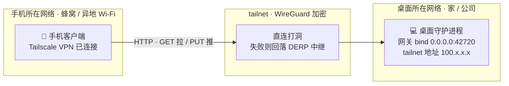

import { Step, Steps } from 'fumadocs-ui/components/steps'
import { Tab, Tabs } from 'fumadocs-ui/components/tabs'

UniClipboard 的手机端是一个 **HTTP 伴侣** —— 它不加入空间的信任网络、也不跑
P2P 节点，只是拿 base URL + Basic Auth 去读写桌面端暴露的那个小型 HTTP 网关。
默认情况下这个网关**只在同一个 Wi-Fi 下可达**：手机一旦走 4G/5G、或接了别人的
Wi-Fi，就拨不通它。

把桌面与手机都接进同一个 **Tailscale 网络（tailnet）**，两端就各自拿到一个
`100.x.x.x` 地址，手机可以像在同一个 LAN 里一样直接连桌面 —— 整条通道由
Tailscale / WireGuard 加密承载。不需要 VPS、不需要域名、不需要证书。

这篇文档解答：

- 这条路解决什么、**不**解决什么（尤其是它并没有帮你把网关关起来）
- 桌面与手机分别怎么配（GUI 与 CLI 两条路径）
- 为什么扫一次码就同时拿到 LAN 与 tailnet 两条地址
- 进阶：让桌面 ↔ 桌面的 P2P 也走 tailnet
- 它与[自建 server 节点](./self-host-server-node)该怎么选

## 它解决什么、不解决什么

它换的只是**可达性**，没有换掉协议本身：

- **解决**：手机在任意网络下都能拨通桌面的网关。机密性由你信任的
  Tailscale / WireGuard 隧道托底。
- **不解决**：网关对外**依然是明文 HTTP + Basic Auth**。这条路不提供端到端
  TLS 语义 —— 如果你的威胁模型要求这个，看 [自建 server 节点](./self-host-server-node)
  （真证书 HTTPS）。
- **不解决**：桌面休眠 / 关机时，手机同样拨不通。tailnet 不会替你把桌面留在线上。
  需要「桌面全休眠时同步仍然在线」，那是 server 节点的场景。

<Callout type="warn">
  **Tailscale 不会帮你关掉 LAN 上的监听。** 网关的 socket **永远 bind 在 `0.0.0.0`**，
  这一点不可配置。下面要用到的「监听 IP」下拉是**纯广告语义** —— 它只决定发给手机的安装
  URL / 二维码里写哪个地址，**不改变 socket 监听在哪**。所以即使你选了 `100.x.x.x`，
  网关**仍然在你的物理 LAN 上明文监听**。Tailscale 给你的是「手机能从外面连进来」，
  **不是**「别人连不进来」。在不可信网络（公共 Wi-Fi）下，该关就关。
</Callout>

## 跨网络是怎么走的



对比 [server 节点](./self-host-server-node) 那条路：这里**没有 VPS、没有 Caddy、
没有证书签发**，链路上少了一整台机器。代价是桌面必须醒着。

## 前置条件

- 一个 Tailscale 账号，桌面与手机都能登同一个。
- 桌面端 UniClipboard **0.12 或更新**（「监听 IP」下拉从 0.12 起才列 CGNAT 段）。
- 桌面在同步期间**保持唤醒** —— 休眠即不可达。
- 手机端装 [UniClipboard 移动端 App](https://github.com/UniClipboard/UniClip)。

## 配置步骤

<Steps>

<Step>

### 两端装 Tailscale，登录同一账号

桌面与手机都要装 Tailscale，并且**登录同一个账号**。以官网
[tailscale.com/download](https://tailscale.com/download) 为准，常见平台如下：

<Tabs items={['Linux', 'macOS', 'Windows', 'iOS', 'Android']}>

<Tab value="Linux">

官方一键脚本（自动识别发行版，装好 `tailscaled` 服务并设为开机自启）：

```bash
curl -fsSL https://tailscale.com/install.sh | sh
```

然后登录并接入（会打印一个授权链接，用浏览器打开完成登录）：

```bash
sudo tailscale up
```

`tailscale status` 应能列出本机和 tailnet 上的其它设备。

</Tab>

<Tab value="macOS">

三选一：

- **App Store** —— 搜 **Tailscale** 安装（含菜单栏 GUI，最省事）。
- **独立版** —— 从 [tailscale.com/download/macos](https://tailscale.com/download/macos) 下 `.pkg`。
- **Homebrew（CLI / 无头）**：

  ```bash
  brew install tailscale
  sudo tailscale up
  ```

GUI 版装好后在菜单栏点 **Connect** 并登录即可。

</Tab>

<Tab value="Windows">

从 [tailscale.com/download/windows](https://tailscale.com/download/windows) 下安装包，
或用 winget：

```powershell
winget install tailscale.tailscale
```

装好后在系统托盘点 Tailscale 图标 → **Log in / Connect**，登录账号。

</Tab>

<Tab value="iOS">

在 App Store 搜 **Tailscale** 安装（[App Store 链接](https://apps.apple.com/app/tailscale/id1470499037)），
登录账号后打开 VPN 开关。系统会要求授权添加 VPN 配置，确认即可。

</Tab>

<Tab value="Android">

在 Google Play 搜 **Tailscale** 安装
（[Google Play 链接](https://play.google.com/store/apps/details?id=com.tailscale.ipn)），
登录账号后打开 VPN 开关。国内设备没有 Google Play 时，可从官网下 APK。

</Tab>

</Tabs>

桌面端保持「Connected」；手机端把 VPN 开关打开。两端都接入后，在任一端的
Tailscale 客户端「Machines」列表里应该能看到对方，每台机器带一个 `100.x.x.x`
的 tailnet IPv4。**先确认这一步成立再往下走** —— 后面所有问题九成出在这里。

</Step>

<Step>

### 在桌面把广告地址指向 tailnet

<Tabs items={['GUI', 'CLI']}>

<Tab value="GUI">

进 **设备 → 手机同步 → 配置**，在**监听 IP** 下拉里选那个 `100.x.x.x`
（Tailscale 段）的条目。**当前监听地址**行会立刻切到 `http://100.x.x.x:42720`，
之后签发的所有设备凭据 URL 都带这个地址。

不需要重启 daemon —— 监听器是热切换的。

</Tab>

<Tab value="CLI">

先列出可选网卡，找到 `100.` 开头的那个：

```bash
uniclip mobile network interfaces
```

然后把广告地址指过去（`--ip` 会渲染成 `http://<IP>:42720`）：

```bash
uniclip mobile network set --ip 100.101.102.103 --accept-network-risk
```

<Callout type="info">
  `--accept-network-risk` 只是跳过那句交互式 y/N 确认，**不改变任何技术行为**；非交互
  场景（脚本 / CI）下必须带。它打印的那段警告文案是 LAN 语境的硬编码文本，走 tailnet
  时也会照样打印 —— 以本页上面那条 warn callout 为准。
</Callout>

</Tab>

</Tabs>

<Callout type="info">
  这与 **设置 → 网络 → 允许覆盖网络地址** 开关**无关**。那个开关管的是桌面 ↔ 桌面的
  P2P 路径候选（见[下文](#进阶让桌面之间的-p2p-也走-tailnet)），手机同步这里是你手动挑一个地址交给手机，
  所以 Tailscale 段在这个下拉里**始终可见**。这两套机制是刻意分开的。
</Callout>

</Step>

<Step>

### 添加设备，让手机扫码

照常走 [手机同步 → 添加设备](../core-features/mobile-sync#一键启用)：

```bash
uniclip mobile add --label "我的 iPhone"
```

弹窗 / 终端里的二维码现在编码的就是 tailnet 地址。**一次性密码只显示一次**，当场记下。

已经配过、但当时选的是 LAN 网卡也不用重新添加设备 —— 在凭据弹窗 / 设备卡片
dialog 的 **baseUrl 下拉**里切到 Tailscale 网卡，二维码会原地刷新。

</Step>

<Step>

### 手机扫码，并保持 Tailscale 在线

用 UniClipboard App 扫码，字段自动填好。之后**只要手机的 Tailscale VPN 处于
「Connected」**，无论走蜂窝还是任意外部 Wi-Fi，都能跟桌面双向同步。

</Step>

</Steps>

## 你不用手动填两条地址

二维码里编码的**不是一个地址，而是一份候选列表**：桌面在签发凭据时会把所有合格
网卡（LAN 的 `192.168.x` / `10.x` 与 tailnet 的 `100.x`）**一起**塞进 connect URI，
客户端逐个探测、挑能拨通的那条。

所以扫一次码，你就同时拿到了两条路：**在家自动走 LAN 直连**（快，不绕
WireGuard），**在外自动回落 tailnet**。换网络后 App 会重新选路，界面上会标注
「将使用」哪个地址，不需要手动切换。

下拉里 CGNAT 段被**排在最后**（顺序为 `10/8 → 172.16/12 → 192.168/16 → 100.64/10`），
所以真实 LAN 网卡优先；只有在**没有任何 RFC1918 网卡**可选时，才会自动选中 tailnet 地址。

## 进阶：让桌面之间的 P2P 也走 tailnet

上面讲的都是**手机 ↔ 桌面**。桌面之间走的是 iroh P2P，它对 Tailscale 地址的默认
处理**恰好相反**：

| | Tailscale `100.x` 默认行为 | 为什么 |
| --- | --- | --- |
| 手机同步（广告地址） | **默认带上** | 地址是你手动挑的，不存在探路成本 |
| 桌面 P2P（直连候选） | **默认过滤掉** | 自动 path racing 会把探路预算烧在死路上 |

这是刻意设计的不对称，也是本页最容易被搞混的一点。**两台桌面都接同一个 tailnet**
且希望 iroh 利用这条路时，才需要打开：**设置 → 网络 → 允许覆盖网络地址**。

打开后，Tailscale CGNAT（`100.64.0.0/10`）与 IPv6 ULA（`fd7a:115c:a1e0::/48`）
才会作为直连候选发布、并写进配对邀请。

<Callout type="warn">
  **改完必须重启 daemon。** 地址过滤器是在 iroh endpoint **bind 时固定**的，这个开关不会热生效。
</Callout>

<Callout type="info">
  Clash TUN 的 fake-ip（`198.18.0.0/15`）与 IPv4 link-local（`169.254.0.0/16`）**始终被过滤、
  没有开关** —— 这类网卡本来就不能拿来真实拨号。
</Callout>

典型症状：sponsor 端跑着 Tailscale，joiner 拿到的邀请里全是不可达的 LAN 地址、
一直拨不通 —— 见[配对失败](../help/troubleshooting#配对失败)。

## 注意事项与限制

- **两端都要保持 Tailscale 在线。** 手机端一旦断开（手动 Disconnect、被系统杀后台、
  长时间无流量被挂起），就回到「LAN 外不可达」，请求会超时。
- **不支持 MagicDNS 主机名。** connect URI 里固定写 `100.x.x.x` 数字 IP；即使你给
  桌面配了 `desktop.tail-XXXX.ts.net` 这样的别名，我们**不会**把它写进去。
- **DERP 回落会明显变慢。** tailnet 打洞失败时流量走 Tailscale 的 DERP 中继，带宽
  远低于直连，传大图 / 大文件会很吃力。在 Tailscale 客户端里确认两台机器是
  **直连**还是 **DERP**。
- **手机后台限制依旧。** iOS 锁屏 / 切后台、Android 10+ 都会限制剪贴板读写 ——
  这与 Tailscale 无关，是系统行为。需要稳定后台同步就把 App 留在前台。
- **网关仍在 LAN 上监听**（见开头的 warn callout）。

## 排错

| 现象 | 看哪里 |
| --- | --- |
| App 报连接超时 | 先在两端 Tailscale 客户端的「Machines」列表确认**双方都在线**。九成问题在这一步。 |
| 手机能 ping 通 `100.x` 但 App 超时 | 桌面端网关没开或端口不对。跑 `uniclip mobile status` 看当前监听 URL。 |
| 同步很慢、大文件传不动 | 两端多半退到了 DERP 中继。在 Tailscale 客户端看连接类型是直连还是 DERP。 |
| 提示鉴权失败 / 401 | 用户名或密码不对。桌面端轮换密码后在手机重填。 |
| 换回家里 Wi-Fi 后连不上 | 看 App 里「将使用」的是哪条地址；确认 LAN 那条也在候选列表里。 |
| 桌面 ↔ 桌面配对拨不通 | sponsor 端打开**允许覆盖网络地址**并**重启 daemon**，Tailscale 地址才会进邀请。 |

## 该选哪个：Tailscale 还是 server 节点

| | Tailscale | [server 节点](./self-host-server-node) |
| --- | --- | --- |
| 需要 VPS / 域名 | ❌ 不用 | ✅ 需要 |
| 桌面休眠时仍能同步 | ❌ 不能 | ✅ 能 |
| 手机端要另装 App | ✅ 要装 Tailscale | ❌ 不用 |
| 传输机密性 | 🔒 WireGuard 隧道（网络层） | 🔒 真证书 HTTPS |
| 大文件速度 | ⚡ 直连快；DERP 回落慢 | 🌐 取决于 VPS 带宽 |
| 运维成本 | 🟢 几乎没有 | 🟡 需要维护容器、证书、备份 |

两端都在你自己手里、又不想养一台 VPS —— 选 Tailscale。要「桌面全关机时手机
依然能收发」或者需要一个稳定的公网 HTTPS 端点 —— 选 server 节点。

两条路**不冲突**：你完全可以同时配好，让手机的候选地址列表里既有 tailnet
也有公网网关。
